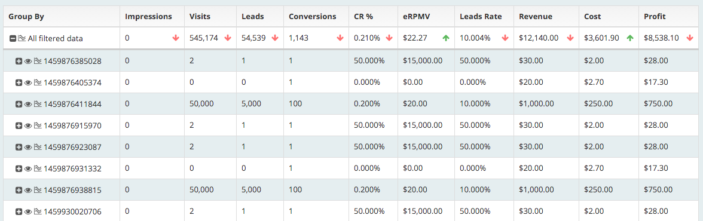
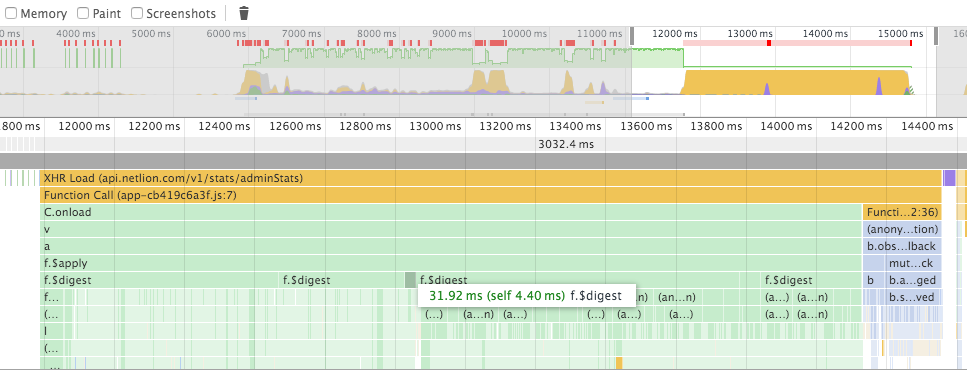
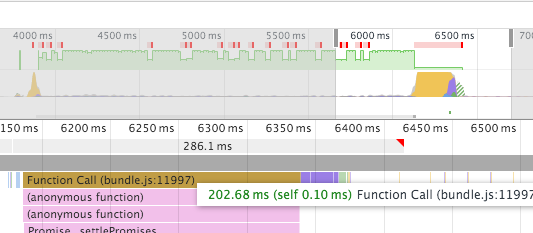
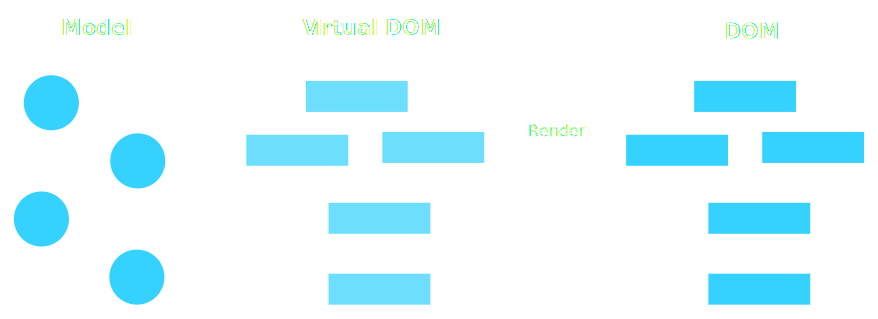
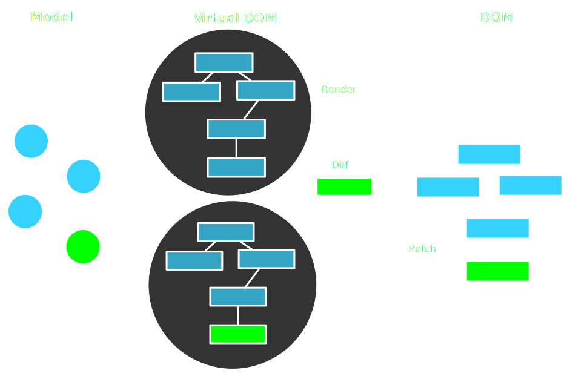

title: React at Treexor
author:
  twitter: axelhzf
  url: http://axelhzf.com
output: index.html
controls: false
theme: ./theme

-- cover

# React at


--

## Warning #1

This is a talk about React. But it's also a talk about why is better than Angular.js. During this talks it will look like I hate Angular.js, but it's not so bad.

--

## Warning #2

Be careful of [Javascript Fatigue](http://www.2ality.com/2016/02/js-fatigue-fatigue.html).

 **Don’t try to know everything – it’s impossible in modern web development**.

--

# What is React?

React is a Javascript **Library** for building user interfaces

--

## Library vs  Framework

--

> A library is essentially a set of functions that you can call, these days usually organized into classes. Each call does some work and returns control to the client.
> -- Martin Fowler

--

> A framework embodies some abstract design, with more behavior built in. In order to use it you need to insert your behavior into various places in the framework either by subclassing or by plugging in your own classes. The framework's code then calls your code at these points.
> -- Martin Fowler

--

## React is a library
## Angular.js is a framework

--

## React is just the UI.
## It's the V in the MVC.

--

## React API surface is small

<blockquote class="twitter-tweet" data-lang="en"><p lang="en" dir="ltr">what i&#39;m most impressed about react is that i basically learned it in one day and am not frustrated at all. suck it, angular.</p>&mdash; Jongleberry (@jongleberry) <a href="https://twitter.com/jongleberry/status/588590842748637184">April 16, 2015</a></blockquote>

--

### React is all about **modular** and **composable** components.

Components are the equivalent to angular's directives

---

## This is a Component

```js
import React from react;

class HelloWorld extends React.Component {

    render() {
      return <h1>Hello World</h1>;
    }

}
```

---

## This is how to use a Component

```js
import ReactDom from "react-dom";
ReactDOM.render(<HelloWorld />, document.getElementById('container'));
```

---

## Components have props
Props is data passed from its parent, to the component.

```js
class Hello extends React.Component {
    render() {
      const {name} = this.props
      return <h1>Hello {name}</h1>;
    }
}

<HelloWorld name="Treexor"/>;
```

---

## Components have internal state

```js
class Hello extends React.Component {
    state = {
       counter: 0
    };
    increment: () => {
      this.setState({counter: this.state.counter + 1});
    };
    render() {
      const {counter} = this.state;
      return (
        <div>
          <h1>Counter {this.counter}</h1>
          <button onClick={this.increment}>Increment</button>
        </div>
      );
    }
}

```

---

## Components lifecycle

```js
class LifeCycleComponent extends Component {
    state = {
       counter = 0
    };
    componentDidMount() {
        this.interval = setInterval(() => this.setState({
            counter: this.state.counter + 1
        }), 1000);
    }
    componentDidUnmount() {
        clearInterval(this.interval)
    }
    render() {
        const {counter} = this.state
        return <p>{counter}</p>
    }
}
```

--

## But I need more things to build an application:

* Dependency injection
* HTTP calls
* Promises
* Models

--

### ES6 modules > Angular's Dependency Injection

```js
// service.js
class Service {
   myMethod() {}
}
export default new Service();

// MyComponent.js
import service from "./service";

class MyComponent {
    render() {
        service.myMethod();
    }
}
```

--

### Promise > $q

You can use a Promise polyfill or the high performant [Bluebird](https://github.com/petkaantonov/bluebird).

```js
import Promise from "bluebird";
const waitTime = (ms) => {
    return new Promise(resolve => setTimeout(resolve, ms))
}
```

--

### fetch > $http

* Browser are implementing [fetch](https://developer.mozilla.org/en/docs/Web/API/Fetch_API). You can use a [polyfill](https://github.com/github/fetch).
* For Universal applications you can use [isomorphic-fetch](https://github.com/matthew-andrews/isomorphic-fetch)

```js
fetch('/users.json')
  .then(response => response.json())
  .then(json => console.log('parsed json', json)})
  .catch(ex => console.log('parsing failed', ex)})
```

--

### ??? > $resource

You don't really what to use that

--

### Predictable state container for JavaScript apps

### Flux, Redux or Relay

[http://axelhzf.com/talk-new-ideas-web-app/#/25](http://axelhzf.com/talk-new-ideas-web-app/#/25)

--

## Why so much hype about React?

* Real projects (Facebook, Instagram, Netflix, Paypal)
* Good performance
* Really smart people in the community
* Innovation: One way data binding, Immutability, Universal Applications, React Native

-- cover

## React at


--

## Stats table performance

--



--



--


--



--

## Netlion Landing pages


--

## Requirements

* Speed
* Server-less (CDN)
* SEO
* Maintainability

--

## Solution: Universal Javascript application

Server and client share the same code.

In our case, we don't have servers, we render the application to static htmls.

--

# React Native

~~Write once run everywhere~~

Learn once, write everywhere

--

### Before we talk about React Native, we need to understand how React works.

--

# DOM UPDATE CYCLE

* Every time state change `setState()`, React calls render method
* `render` create a virtual dom representation
* Compare the new and the old tree using reconciliation
* Creates a batch of DOM updates

--



--



--

# VIRTUAL DOM

* It's fast
* React is not the only implementation
* Render to something different that the DOM: string (server-side-render), native components (react-native), canvas (react-canvas)

--

### React Native adds the ability for React components to render to Native Components rather than DOM.

--


```js
<View>
  <Text style={styles.text} >
    Accesibility Inspector
  </Text>
  <Switch
      onValueChange={(value) => this.setState({falseSwitchIsOn: value})}
      style={{marginBottom: 10}}
      value={this.state.falseSwitchIsOn} />
</View>
```

--

```js
var styles = StyleSheet.create({
  container: {
    flex: 1,
    justifyContent: 'center',
    alignItems: 'center',
    backgroundColor: '#F5FCFF',
    flexDirection: "row"
  },
  welcome: {
    fontSize: 40,
    textAlign: 'center',
    margin: 10,
    flex: 1
  },
  image: {
    width: 135,
    height: 210
  }
});
```

--


--

# WHY THIS IS SO IMPORTANT?

--

## NATIVE DEVELOPMENT SUCKS

* iOS and Android
* Developer Velocity
* Reuse libraries
* Manual View Layout

--

## REACT NATIVE

* Declarative views
* Native Scripting
* npm modules
* CSS subset
* Platform components
* Incremental adoption

--

## React Native Demo


<script async src="http://platform.twitter.com/widgets.js" charset="utf-8"></script>
<script type="text/javascript">
    var _gaq = _gaq || [];
    _gaq.push(['_setAccount', 'UA-31904298-1']);
    _gaq.push(['_trackPageview']);

    (function() {
        var ga = document.createElement('script'); ga.type = 'text/javascript'; ga.async = true;
        ga.src = ('https:' == document.location.protocol ? 'https://ssl' : 'http://www') + '.google-analytics.com/ga.js';
        var s = document.getElementsByTagName('script')[0]; s.parentNode.insertBefore(ga, s);
    })();
</script>